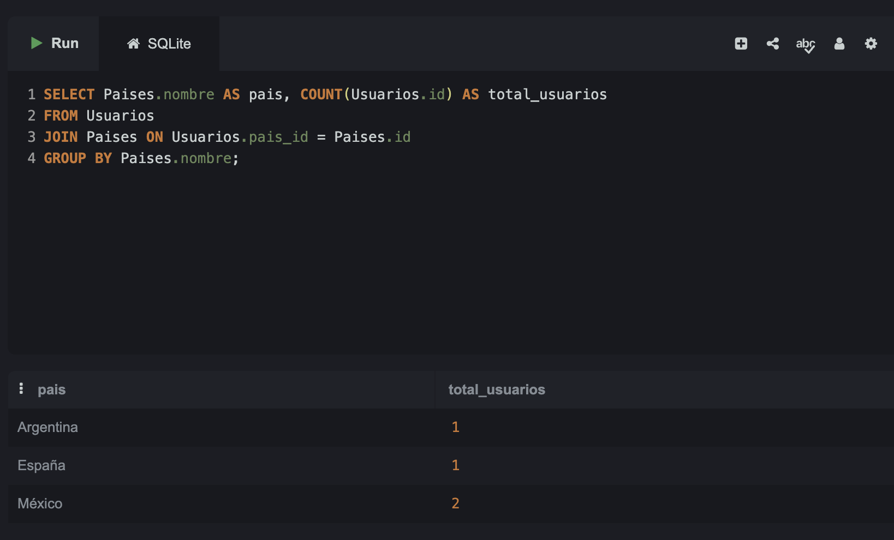
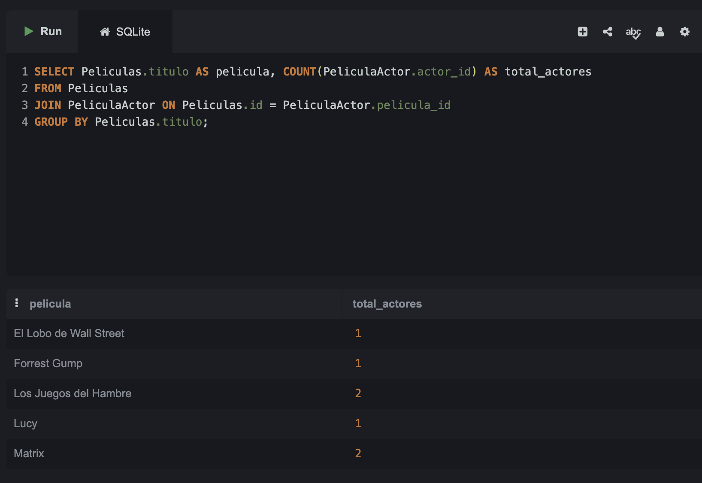
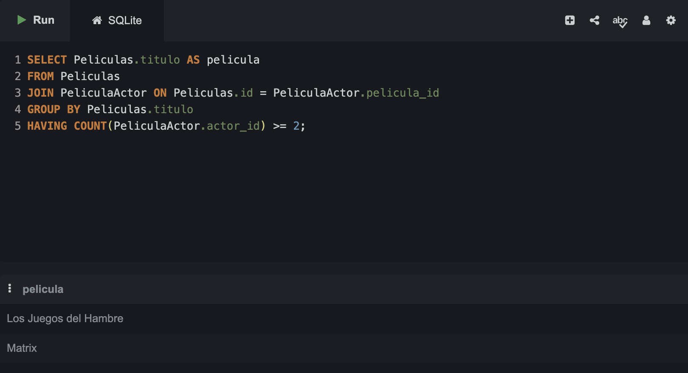
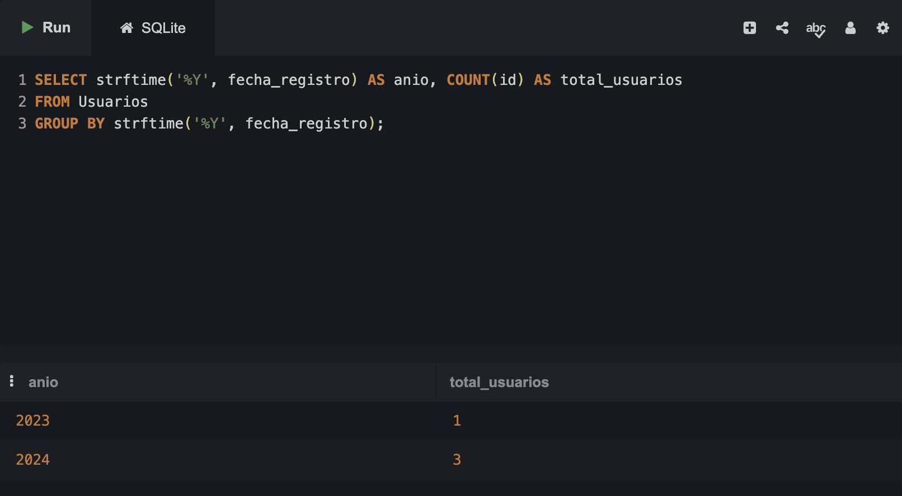
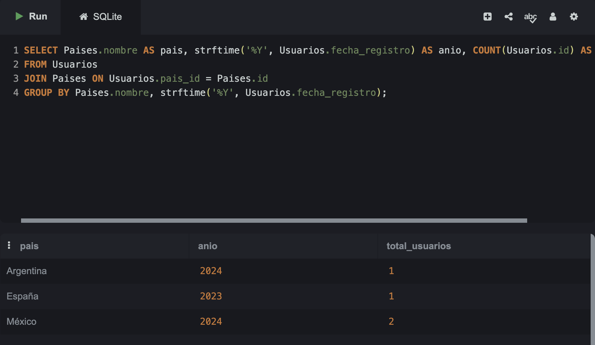
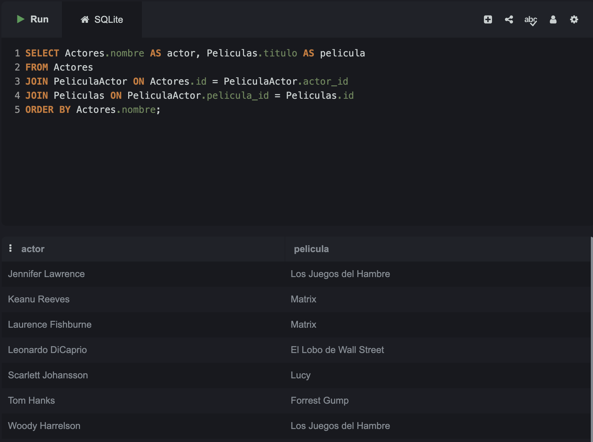
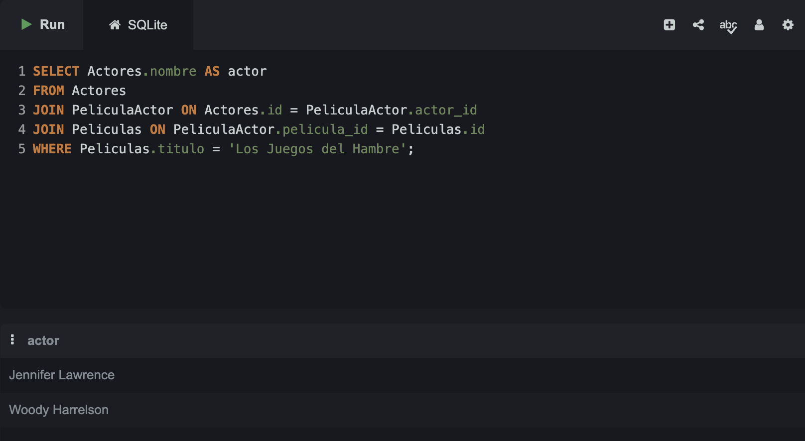
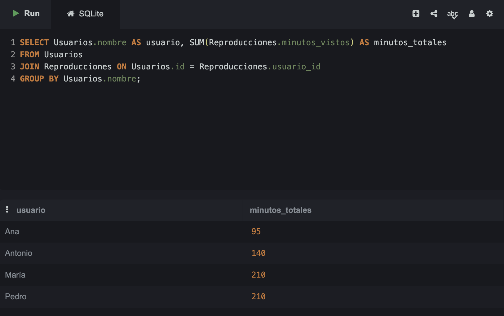
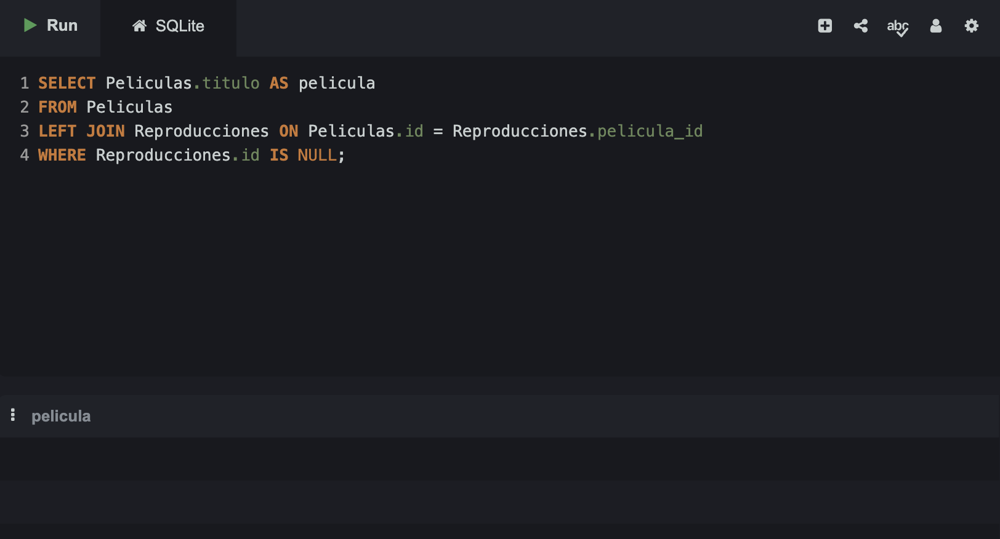
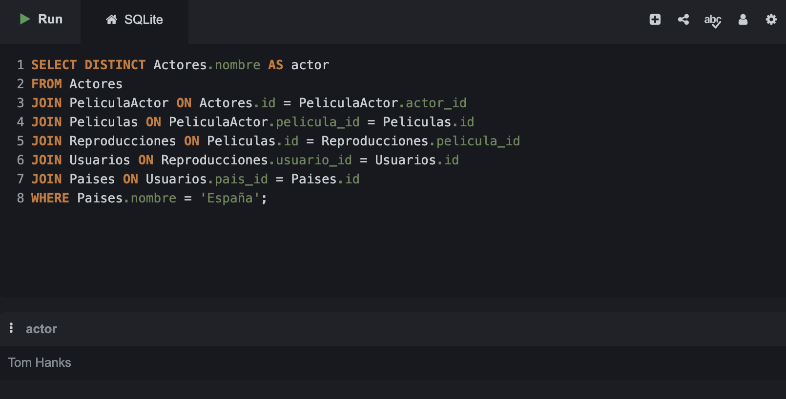

# Normalización en bases de datos y consultas SQL – Películas

## Pregunta 1. Total de usuarios por país

```sql
SELECT Paises.nombre AS pais, COUNT(Usuarios.id) AS total_usuarios
FROM Usuarios
JOIN Paises ON Usuarios.pais_id = Paises.id
GROUP BY Paises.nombre;
```



---

## Pregunta 2. Número de actores registrados por película

```sql
SELECT Peliculas.titulo AS pelicula, COUNT(PeliculaActor.actor_id) AS total_actores
FROM Peliculas
JOIN PeliculaActor ON Peliculas.id = PeliculaActor.pelicula_id
GROUP BY Peliculas.titulo;
```



---

## Pregunta 3. Películas en las que haya dos o más actores

```sql
SELECT Peliculas.titulo AS pelicula
FROM Peliculas
JOIN PeliculaActor ON Peliculas.id = PeliculaActor.pelicula_id
GROUP BY Peliculas.titulo
HAVING COUNT(PeliculaActor.actor_id) >= 2;
```



---

## Pregunta 4. Total de usuarios registrados por año

```sql
SELECT strftime('%Y', fecha_registro) AS anio, COUNT(id) AS total_usuarios
FROM Usuarios
GROUP BY strftime('%Y', fecha_registro);
```



---

## Pregunta 5. Total de usuarios registrados por país y por año

```sql
SELECT Paises.nombre AS pais, strftime('%Y', Usuarios.fecha_registro) AS anio, COUNT(Usuarios.id) AS total_usuarios
FROM Usuarios
JOIN Paises ON Usuarios.pais_id = Paises.id
GROUP BY Paises.nombre, strftime('%Y', Usuarios.fecha_registro);
```



---

## Pregunta 6. Películas por actor

```sql
SELECT Actores.nombre AS actor, Peliculas.titulo AS pelicula
FROM Actores
JOIN PeliculaActor ON Actores.id = PeliculaActor.actor_id
JOIN Peliculas ON PeliculaActor.pelicula_id = Peliculas.id
ORDER BY Actores.nombre;
```



---

## Pregunta 7. Actores que aparecen en "Los Juegos del Hambre"

```sql
SELECT Actores.nombre AS actor
FROM Actores
JOIN PeliculaActor ON Actores.id = PeliculaActor.actor_id
JOIN Peliculas ON PeliculaActor.pelicula_id = Peliculas.id
WHERE Peliculas.titulo = 'Los Juegos del Hambre';
```



---

## Pregunta 8. ¿Cuántos minutos ha empleado cada usuario en ver las películas?

```sql
SELECT Usuarios.nombre AS usuario, SUM(Reproducciones.minutos_vistos) AS minutos_totales
FROM Usuarios
JOIN Reproducciones ON Usuarios.id = Reproducciones.usuario_id
GROUP BY Usuarios.nombre;
```



---

## Pregunta 9. Películas que no hayan tenido reproducciones

```sql
SELECT Peliculas.titulo AS pelicula
FROM Peliculas
LEFT JOIN Reproducciones ON Peliculas.id = Reproducciones.pelicula_id
WHERE Reproducciones.id IS NULL;
```



---

## Pregunta 10. Reto: actores de las películas que hayan sido vistas por usuarios de España

```sql
SELECT DISTINCT Actores.nombre AS actor
FROM Actores
JOIN PeliculaActor ON Actores.id = PeliculaActor.actor_id
JOIN Peliculas ON PeliculaActor.pelicula_id = Peliculas.id
JOIN Reproducciones ON Peliculas.id = Reproducciones.pelicula_id
JOIN Usuarios ON Reproducciones.usuario_id = Usuarios.id
JOIN Paises ON Usuarios.pais_id = Paises.id
WHERE Paises.nombre = 'España';
```

